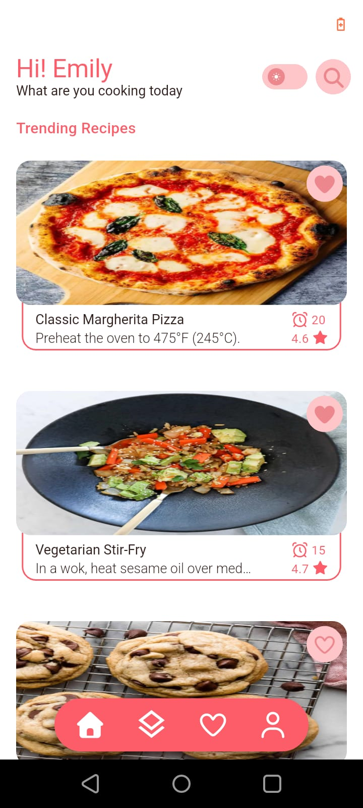
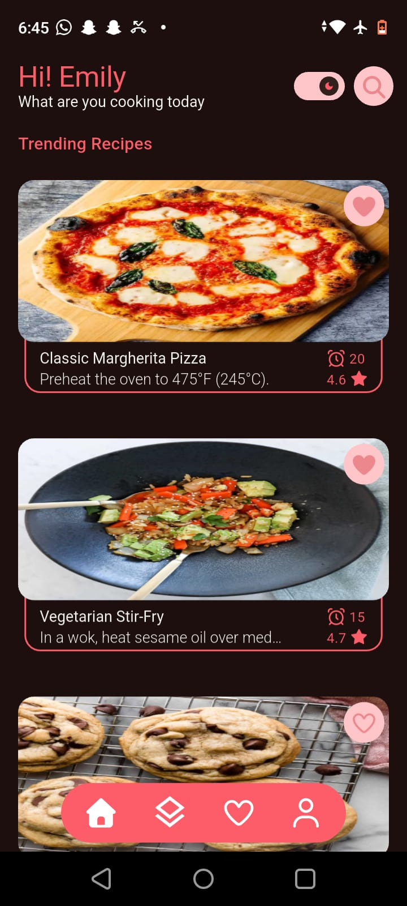
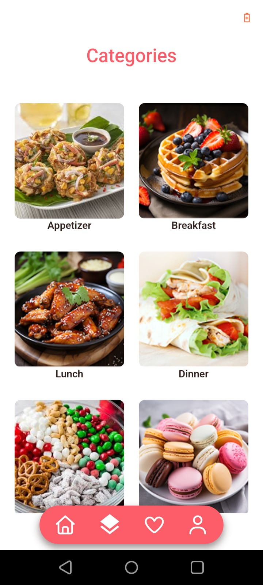
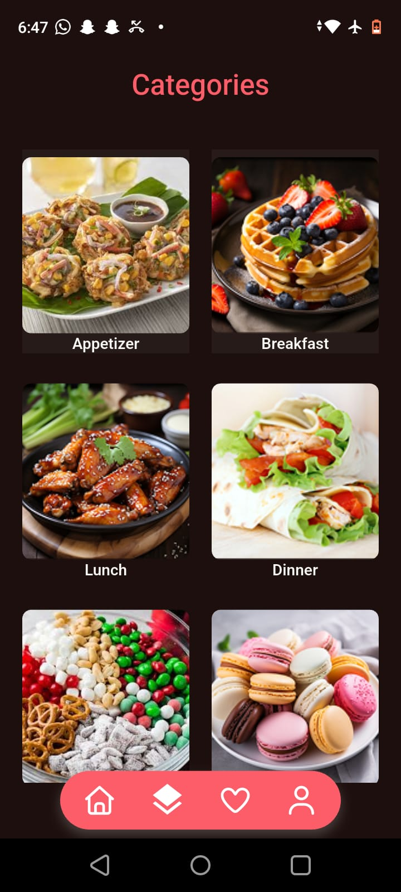
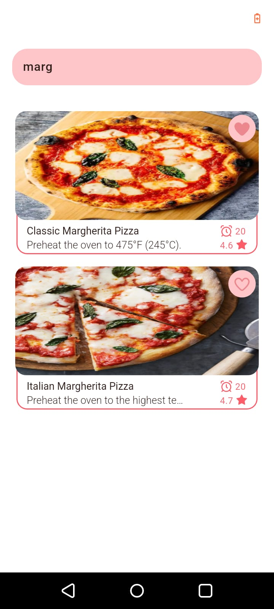
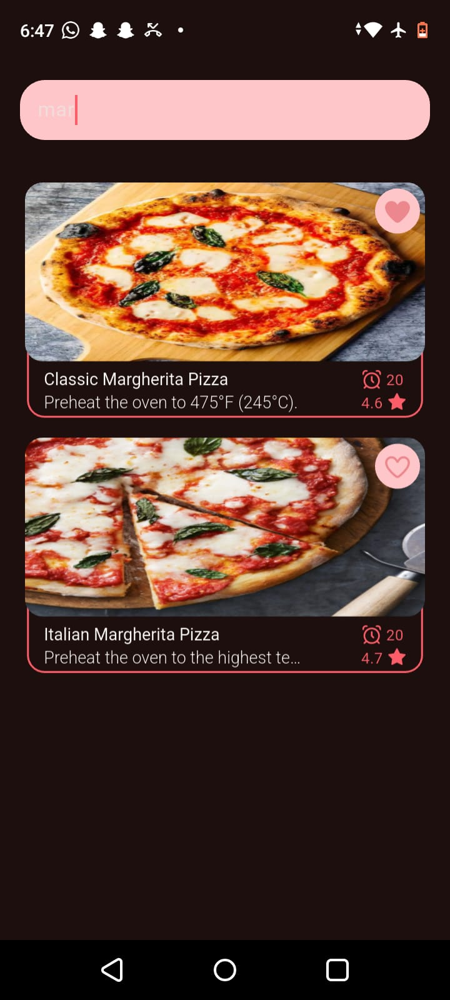
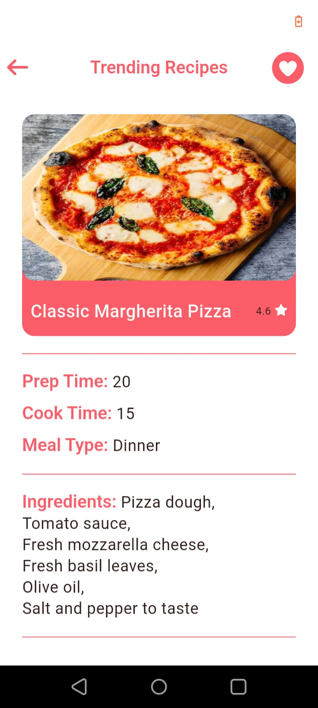
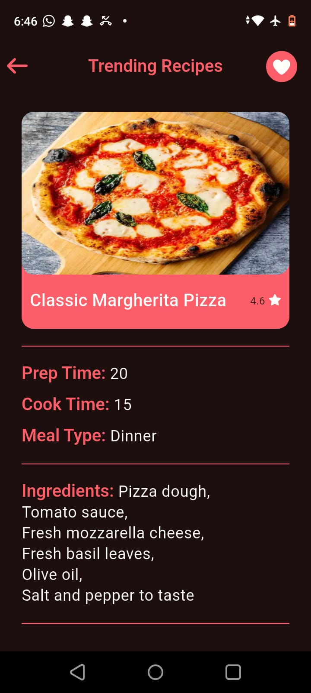
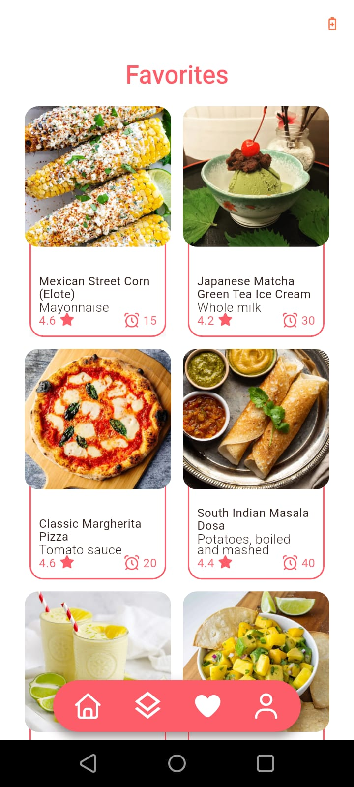
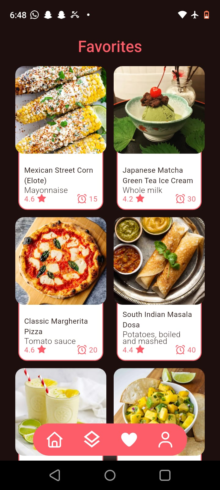

# Recipes App 

A modern Flutter application that helps users discover, search, and save recipes from different categories. The app provides a smooth and responsive user experience while demonstrating best practices in Flutter development, state management, API integration, and local storage management.

## Features

- Browse recipes by category
- Search for recipes
- View detailed recipe information
- Save and manage favorite recipes
- Authentication (Login, Signup, Logout)
- Dark Mode & Light Mode support
- Pagination for efficient data loading
- Offline persistence using local storage
- Secure data storage using Flutter Secure Storage
- Responsive and user-friendly UI

## Tech Stack

- Flutter
- Dart
- Cubit (flutter_bloc)
- REST APIs
- Dio
- Shared Preferences
- Flutter Secure Storage

## Architecture

The project follows a Feature-Based Architecture that organizes the codebase into independent features. Each feature contains its own presentation, business logic, and data layers, making the application scalable, maintainable, and easy to extend.

## State Management

- Cubit (flutter_bloc)

## Key Concepts Demonstrated

- Feature-Based Architecture
- Authentication
- Cubit State Management
- API Integration with Dio
- Repository Pattern
- Pagination
- Error Handling
- Local Storage Management
- Secure Storage
- Dark & Light Theme Support
- Responsive UI Design

## What I Learned

Through building this project, I gained practical experience in:

- Consuming and integrating REST APIs
- Handling API errors and exceptions
- Implementing pagination for large datasets
- Managing application state using Cubit
- Organizing projects using Feature-Based Architecture
- Working efficiently with local storage
- Storing sensitive data securely
- Implementing Dark and Light themes
- Creating reusable and maintainable UI components
- Writing cleaner and more scalable Flutter code

## Project Structure

```text
lib/
├── config/
├── core/
├── features/
│   ├── auth/
│   ├── categories/
│   │   ├── cubit/
│   │   ├── data/
│   │   └── presentation/
│   └── ...
```

## Screenshots

### Home Screen

| Light Mode | Dark Mode |
| :---: | :---: |
|  |  |

### Categories Screen

| Light Mode | Dark Mode |
| :---: | :---: |
|  |  |

### Search Screen

| Light Mode | Dark Mode |
| :---: | :---: |
|  |  |

### Recipe Details Screen

| Light Mode | Dark Mode |
| :---: | :---: |
|  |  |

### Favorites Screen

| Light Mode | Dark Mode |
| :---: | :---: |
|  |  |

## Getting Started

### Clone the repository

```bash
git clone https://github.com/1332003badatarek-glitch/recipes_app.git
```

### Install dependencies

```bash
flutter pub get
```

### Run the application

```bash
flutter run
```

## Requirements

- Flutter SDK
- Dart SDK
- Android Studio or VS Code
- Android Emulator / Physical Device

## Author

**Abdulla Tarek**

Flutter Developer

GitHub: https://github.com/1332003badatarek-glitch